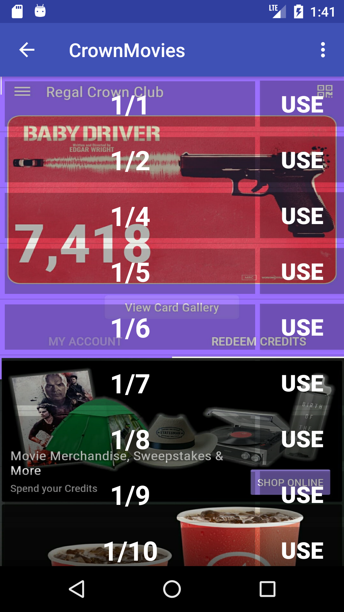
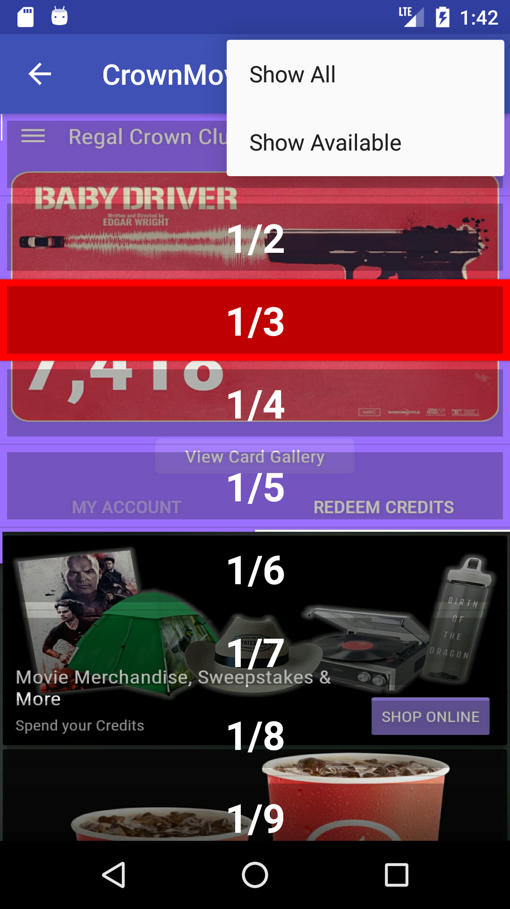
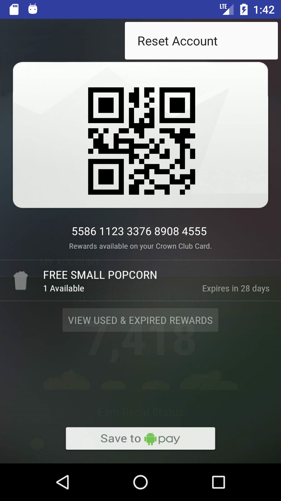

# Multiple Account Regal App
## When your family/friends have multiple accounts and don't want everyone to pull out their phones.

### Purpose of the App
My friends/family are going to the movies more often thanks to Movie Pass. I felt pretty bad for the employyees
having to juggle phones, Movie Pass, QR codes, regal accounts for x amount of people. This app helps accumulate all accounts
in one Phone so its easy as pie. Cake. Easy as.. Stealing Candy from no one, because that's wrong. Just install the app,
store your accounts, and quickly pull every account up you need! It's also a great way to keep track of who has a birthday, 
which Regal awards a free small popcorn! 

### Note
This is made for api > 23
Not certain how it will perform on lower apis. Since my family and friends run somewhat up to date phones, no one needed a lower api.
If there are crashes, let me know and I'll update it to work with lower apis.

### To Install 
Go to my app/release/app-release.apk Or [Click here](https://github.com/Rmacias91/popcorn/blob/master/app/release/app-release.apk)
Download and install on your phone.

You can also install by creating your own apk when opening the project with Android Studio.

### HOW TO USE

1. Create a CSV File name **accounts.csv** in your Downloads Folder with your bday in this format **12/13,55861123337689084534**
You can insert as many accounts as you have by inserting an account and pressing "Enter." An example is provided of the accounts page 
[accounts.csv](https://github.com/Rmacias91/popcorn/blob/master/app/release/accounts.csv)
1. After you've made sure you have the **accounts.csv** in the **Downloads** folder run the app!
1. Accept the two permissions that allow the app to Write into your settings to maximize the brightness when displaying the QR code. If you accidentally click no, it will
prompt you again. Else Restart the app and the app will ask again for permissions.
1. If you do not see the List appear click on the options menu and click show Available. Else, double check the accounts.csv is stored in the correct fomrat as shown in step
1
1. The Screen should look like this.
1. You may press any Birth-date to bring up the QR code.
  1. This app was made to keep track of Birth-dates because Regal Awards free popcorn. If anyone wants I can easily have the list
  provide names instead. 
1. There's an option menu to the top right of the screen.
  1. Show Available will show only accounts that have Birthdays in a month rage and have not been used for the free Popcorn.
  1. Show All will show all accounts in the list. If an account has been used it will be red.
1. You may **use** an account be pressing **USE**. This will remove the account from the Available list and Make the account
Red in the Show All List. This helps keep track when you've used an account for a popcorn.
Here's an Image of what the Show All List looks Like.
1. To Reset an Account from being used, in case you've accidentally used it or it's been a year. Go To Show All. Click The Account. On the top right 
there is a hidden button to the Top Right. Press it, Press Reset Account and select Yes when the Dialogue is prompted. This will Reset the account and will be available to be used again.
*Ignore the Days Available in the QR Generation Screen. The days left is automatically kept track of for the Available List.*

## Questions or Suggestions?
Email me at Rmacias2454@gmail.com
